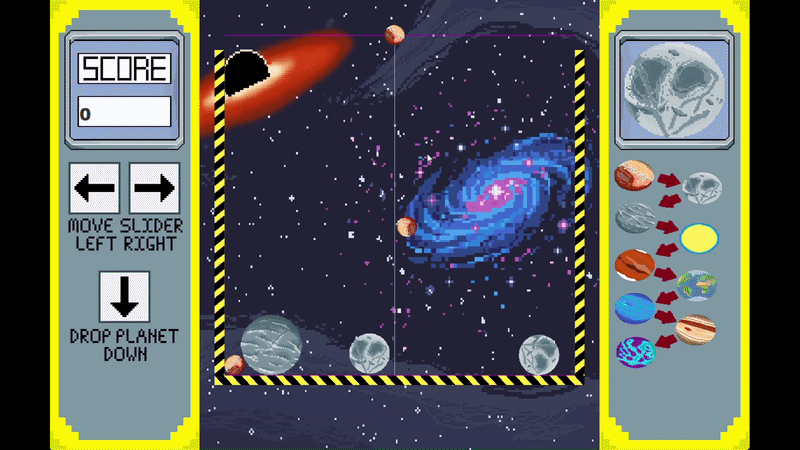
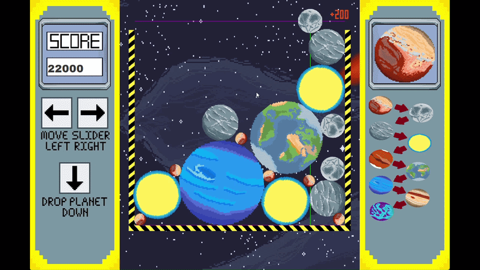

# Physics-based Planet Merger Game

## 🌌 Merger Game

✨ Features
 - 🎨 Multiple different planet types
 - 🎮 Interactive keyboard controls
 - 🟥 Custom pixel art
 - 📐 Realistic 2D physics interactions
 - ⚡ Real-time Java2D rendering
 - 🖥️ Lightweight — no external dependencies

## 🎮 Controls
Key	Action
 - ↓	Release the planet
 - ←	Move the planet left
 - →	Move the planet right
 
## 🛠️ Built With
 - Java
 - Java Swing
 - Java2D

## 🧮 How It Works
This game is a demonstration of physics based collisions between circular objects.

when two planets of the same type collide, they merge to form a larger planet.
When two different planets collide, their respective velocities are calcuated using:

Variables
 - v1,v2 = velocities
 - m1,m2
 - n = unit collision normal
 - e = coefficient of restitution 

Impulse formula
 - J =(v1−v2)⋅n(1+e)/(1m1+1m2)

Then the velocities are updated:
 - v1'= v1−n(J/m1)
 - v2'= v2+n(J/m2)

Another issue faced with games with physics collisions is the pass through issue.
In computer games which simulate physics, two objects constantly colliding will sometimes phase into eachother as the physics simulation starts to break down.
In my game I implemented a feature where planets that have remained stationary for an extended period of time will be locked in place, this halts the physics simualtions and stops this pass through glitch.
When another planet collided with this "locked" planet, the physics simulations will return to the planet.

## Main Components
 - Game    Application entry point and update loop
 - GameEngine	coordinates game logic
 - Planet	Represents an individual planet
 - Vector2D    Handles vector and coordinate operations
 - MainPanel	Renders the game
 - MainDisplay	Creates and manages the application window
 - UserInputListener	Handles keyboard interaction

## 🚀 Getting Started
Requirements:
 - Java Development Kit (JDK)
 - Windows, if using the included run.bat script

You can verify that Java is installed with:

    java -version
    javac -version

Run

Clone the repository:

    git clone https://github.com/BinaryOpus/Physics-based-Planet-Merger-Game.git

Navigate into the project:

    cd "Physics-based Planet Merger Game"

On Windows, run:

    run.bat

Alternatively, compile the source files manually:

    cd src
    javac Game/*.java Model/*.java View/*.java Controller/*.java Assets/*.java Utilities/*.java Textures/*.java
    java Game/Game

## 🎯 Project Future Development
If I ever come to work on this project again there are several things I would like to develope further
 - Endgame - When the game ends, there is a blank screen and a button that simply says try again, I would like to make this look more polished and fit the theme of the game better
 - SFX - Currenly the game has no sound effects or music, it would be a nice touch to add this to the game
 - Floating Planets - There is a glitch where planets sometimes float, this is due to the freezing effect of stationary planets; I would fix the code to avoid this issue
 - Win Condition - Currently the game has no propper win condition
 - Resolution - When I started coding this game, I was young and naïve, I was yet to fully understand that different computers can have different monitor sizes, so hardcoding coordinated based on my screen resoluation may cause issues for people with different monitors 

## ✨ Special Note
Thanks to Gunvir Singh Ranu for letting me use his Vector2D class, the original can be found here:

Original: https://gist.github.com/gunvirranu/6816d65c0231981787ebefd3bdb61f98

## 📜 License

This project is licensed under the terms of the MIT License.
